# Flight Delay Analysis and Prediction

## Steps to deploy the code over AWS

- Create S3 bucket to store the dataset

  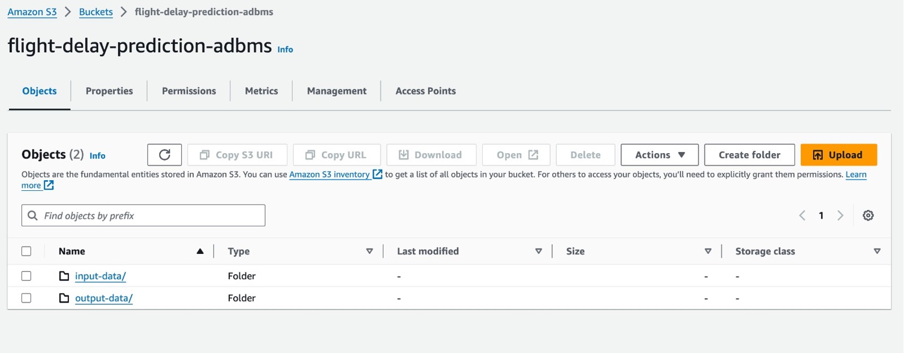
- Setup EMR cluster

  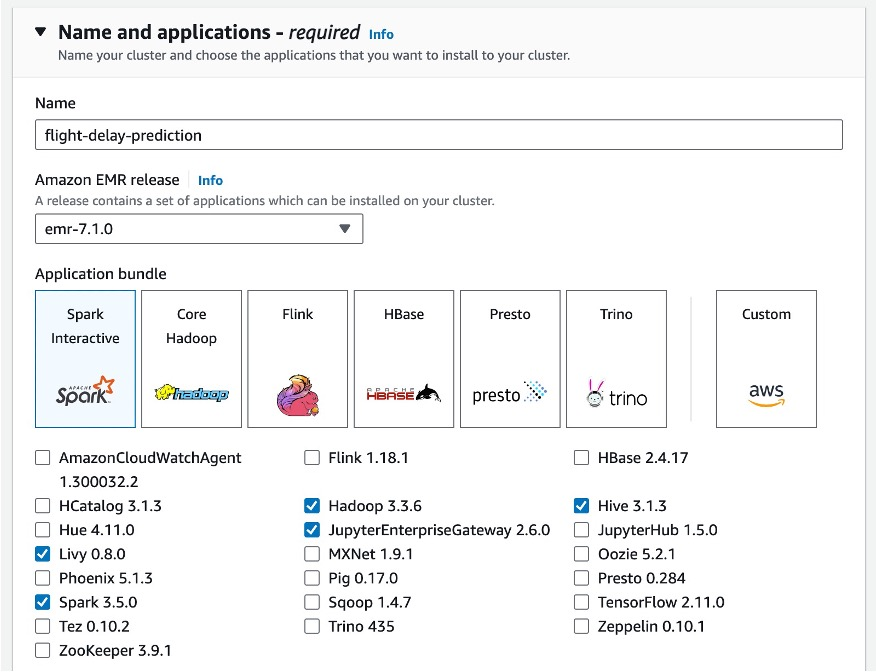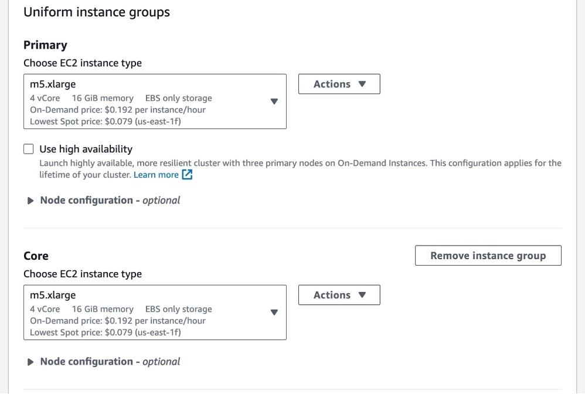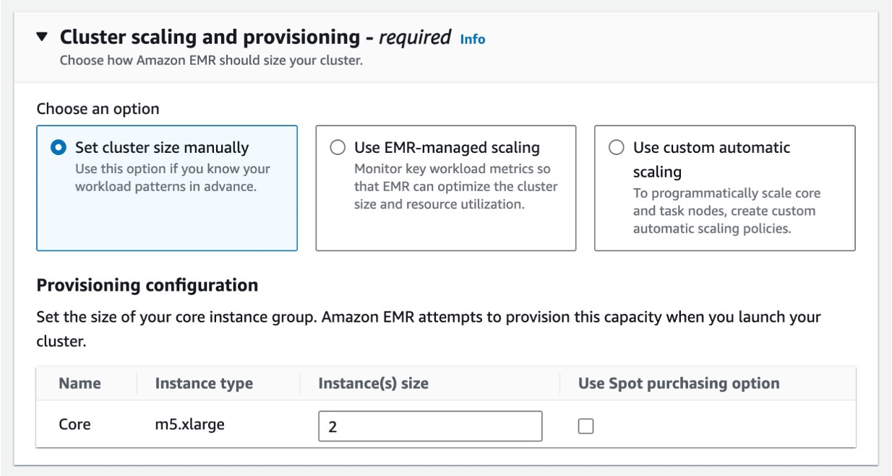
- Setup EMR Workspaces (Notebooks) for the cluster

  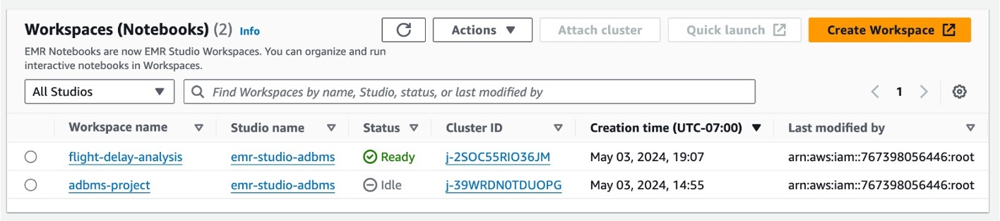
  					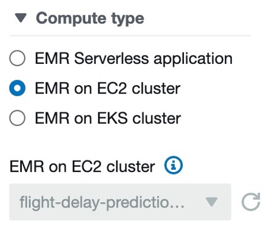
- Load the code into workspaces
- Run the code on notebooks and analysis the distributed nature using Spark UI

## Data Visualization Results

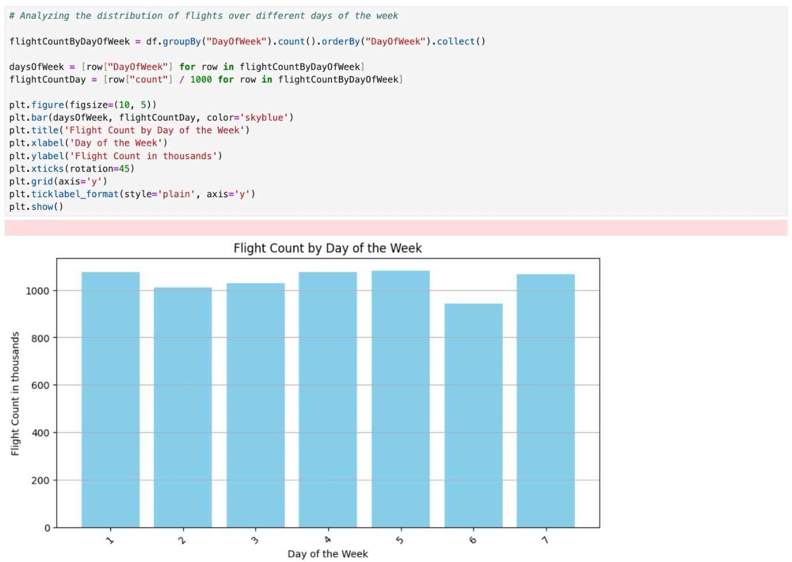

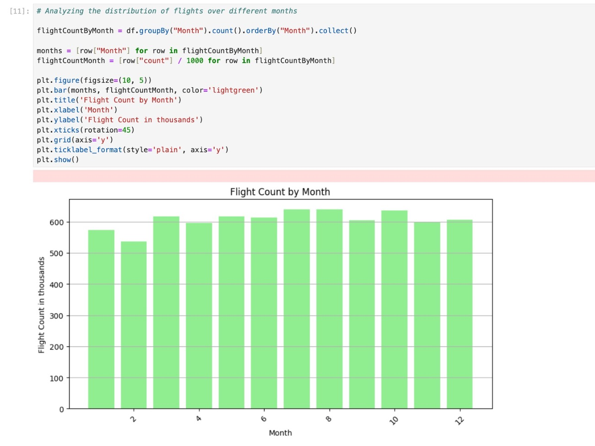

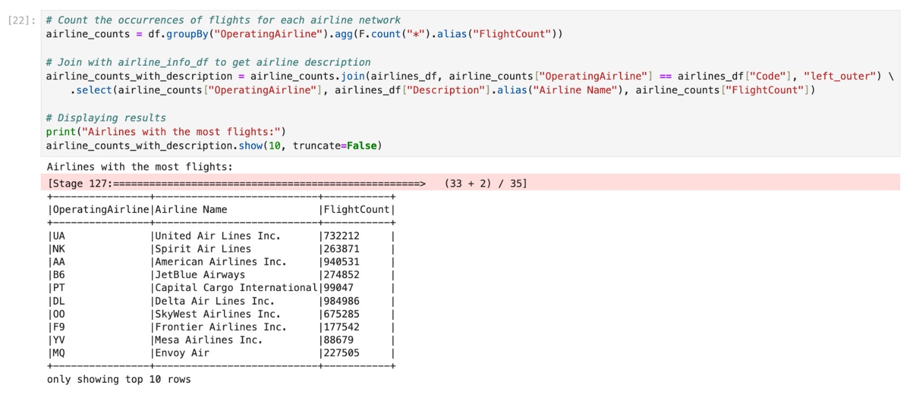

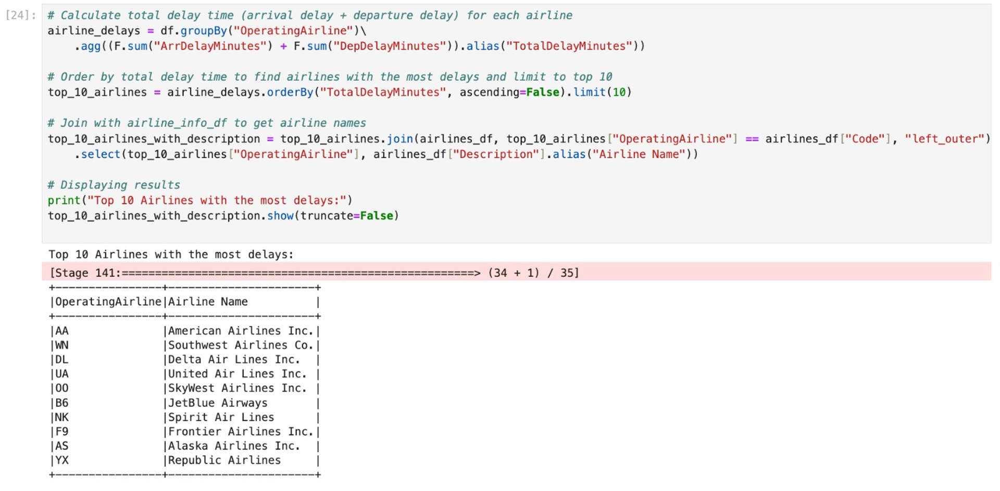

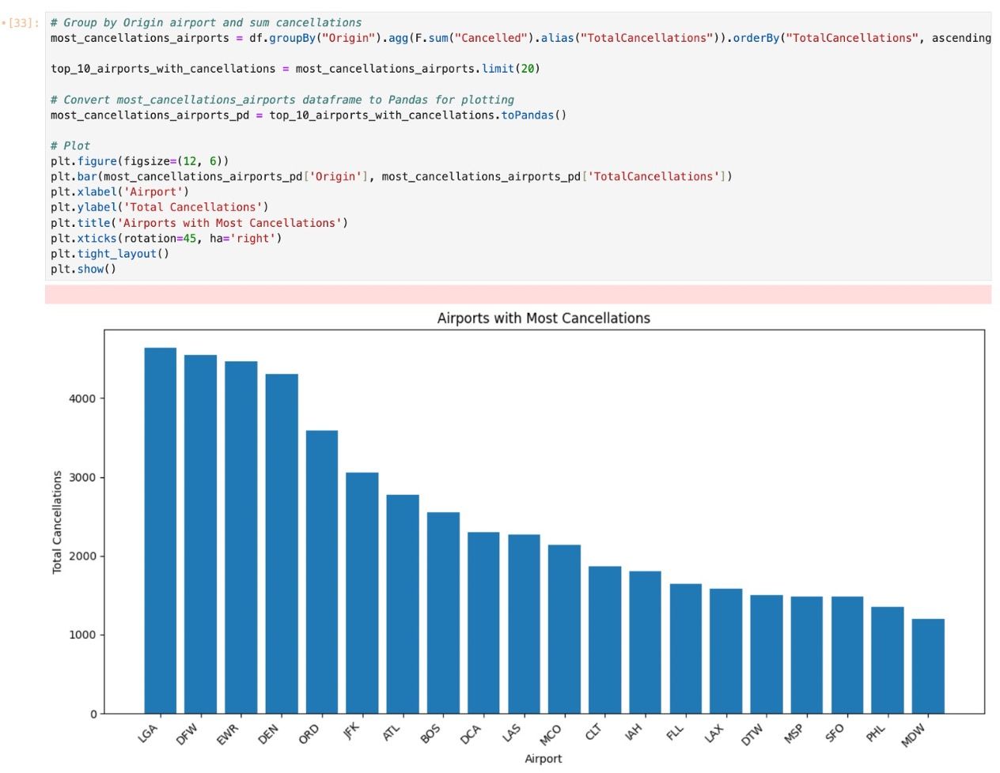
